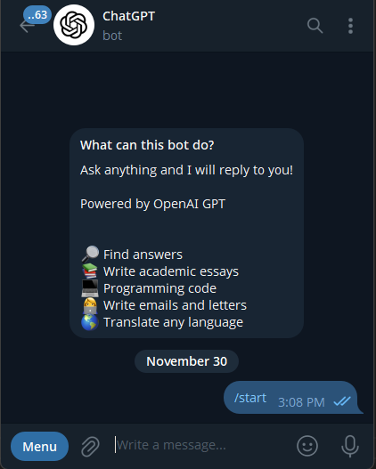

# Telegram GPT Bot (PHP Edition)

🧠 A fully-featured Telegram AI bot written in PHP.  
Supports free & PRO users, persistent memory, auto-summary, model selection, admin controls, and MySQL storage.



---

## ✨ Features

- 🆓 **Free users** with daily message limits  
- ⭐ **PRO users** with unlimited messages & model selection  
- 🧠 **Auto conversation summarization** → long-term memory  
- 🗄️ **MySQL storage** for users & messages  
- 🔧 **Config-based setup** (API keys, Telegram token, etc.)  
- 🤖 **Command handler + buttons**

---

## 📁 Project Structure
project/
- │
- ├── api.php # Main bot logic
- ├── commands.php # /commands handler
- ├── buttons.php # Inline keyboards handler
- ├── migration.php # Fresh DB migration tool
- ├── config.php # Configuration (DB + API keys)
- ├── vendor/ # Composer packages
- └── README.md # You're reading this!

# 🚀 Installation

### 1. Clone the project
```sh
git clone <your-repo-url>
cd your-project
```
## 2. Install dependencies
```sh
composer install
```

## 3. Edit config.php

## 5. Database Migration (Fresh)
GET  
```link
https://yourhost.com/migration.php?pass=ADMIN_PASSWORD
```
## 6. Webhook Setup
GET 
```link
https://api.telegram.org/bot<token>/setWebhook?url=https://yourhost.com/api.php
```

### 🧑‍💻 Contributing
PRs welcome!
You can contribute by:
- Fixing bugs
- Improving documentation
- Adding new Telegram commands
- make tarnslation like not hard coded replys
- Enhancing memory, models, or UI buttons


### 🐞 Bug Reports
Create an issue with:
- Expected behavior
- Actual behavior
- Logs (if possible)
- Steps to reproduce
- PHP version
- Hosting environment

Or contact admin Telegram ID: @MML_0

### 📄 License (MIT)
MIT License

Copyright (c) 2025 MML

You can use it commercially.
